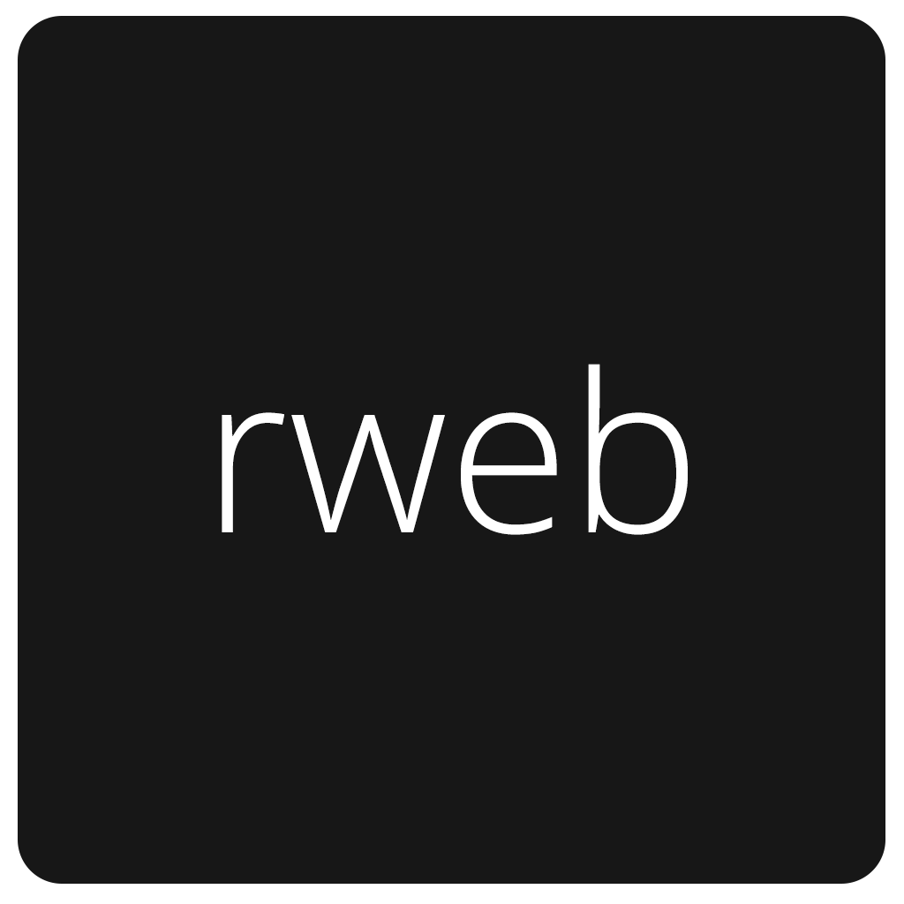

# rweb
> React + Webpack + Electron Boilerplate



# What inside?
`react`, `react-router`, `redux`, `redux-thunk`, `axios`, `webpack`, `css-modules`, `postcss`, `postcss-nested`, `electron`, `eslint` (Airbnb config), `babel` with `object-rest-spread` and  `transform-decorators-legacy` plugins.

> The full list of all dependencies available [here](https://github.com/jestersunborn/rweb/blob/master/package.json)

* babel config [here](https://github.com/jestersunborn/rweb/blob/master/.babelrc)
* eslint config [here](https://github.com/jestersunborn/rweb/blob/master/.eslintrc)
* editor config [here](https://github.com/jestersunborn/rweb/blob/master/.editorconfig)

# Install:
```bash
git clone https://github.com/jestersunborn/rweb.git app-name
cd app-name
yarn
```

Change `package.json` file. Fill the package name, author, repo etc.

And start writing awesome apps!

```bash
yarn start
```

# Production build:
```
yarn build
```

# Build:
> coming soon

# Package:
> coming soon
